# laravel-swimming-reservation-app(水泳施設予約アプリ)

NuxtとLaravelを使用したアプリです。  
水泳施設の予約状況を確認し、予約をすることができます。

## 技術選定の理由

### 1. 開発スピードの最大化と技術の深掘り

これまでに学習してきた「Laravel」をバックエンドに、「Nuxt」をフロントエンドに採用しました。
未知の技術を詰め込むのではなく、すでに基礎を学んだ技術を組み合わせることで、「設計や実用的な機能実装に集中し、アプリを確実に完成させること」を最優先としました。

### 2. フロントエンドとバックエンドの関心事の分離（疎結合な設計）

実務で広く取り入れられている「API駆動開発（フロントとバックを切り離す構成）」に挑戦したかったためです。

## 環境構築

### Dockerビルド

1. リポジトリをクローンします。

```bash
git clone git@github.com:hirata784/laravel-swimming-reservation-app.git
```

2. DockerDesktopアプリを立ち上げます。

3. backendフォルダへ移動します。

```bash
cd laravel-swimming-reservation-app/backend
```

4. コンテナをビルド（構築）し、バックグラウンドで起動します。

```bash
docker compose up -d --build
```

＊MySQLは、OSによって起動しない場合があるのでそれぞれのPCに合わせてdocker-compose.ymlファイルを編集して下さい。

---

### Laravel環境構築

1. PHPコンテナ内に入ります。

```bash
docker compose exec php bash
```

2. プロジェクトに必要なPHPライブラリをインストールします。

```bash
composer install
```

3. 設定ファイルの雛形をコピーして `.env` ファイルを作成します。

```bash
cp .env.example .env
```

4. .envに以下の環境変数を変更します。

```properties
DB_CONNECTION=mysql
DB_HOST=mysql
DB_PORT=3306
DB_DATABASE=laravel_db
DB_USERNAME=laravel_user
DB_PASSWORD=laravel_pass
```

5. アプリケーションキーを作成します。

```bash
php artisan key:generate
```

6. マイグレーションを実行します。

```bash
php artisan migrate
```

7. シーディングを実行します。

```bash
php artisan db:seed
```

8. JWTの署名・検証用の秘密鍵（シークレットキー）を生成します。

```bash
php artisan jwt:secret
```

9. PHPコンテナ内での作業が終わったら、以下のコマンドでホスト側（自分のパソコン）に戻ります。

```bash
exit
```

---

### Nuxt環境構築

1. frontendフォルダへ移動します。

```bash
cd ../frontend
```

2. Nuxtに必要なJavaScriptライブラリをインストールします。

```bash
npm install
```

3. フロントエンドの開発用サーバーを立ち上げます。  
   (※開発作業中は、このターミナルを閉じずに起動したままにしてください)

```bash
 npm run dev
```

## テスト用アカウント

一般アカウント  
name: テスト一郎  
email: ichiro@example.com  
password: ichi1234

---

一般アカウント  
name: テスト次郎  
email: jiro@example.com  
password: jiro5678

---

※上記2人に加え、8人分ランダムで生成され、合計10名分のアカウントが作成されます。  
メールアドレスにはusersテーブルのemailデータを打ち込んでください。  
パスワードは「password」を打ち込んでください。

---

管理者アカウント  
name: 管理者太郎  
email: admin@example.com  
password: admin9999

---

※管理者アカウントを追加する場合

1. 下記のデータ部分を修正して、AdminsTableSeeder.phpに貼り付ける。

```bash
$param = [
    'name' => '管理者太郎',
    'email' => 'admin@example.com',
    'password' => bcrypt('admin9999'),
];
DB::table('admins')->insert($param);
```

2. 修正後、下記をPHPコンテナ内で処理すれば、管理者アカウントを追加できます。

```bash
php artisan migrate:fresh --seed
```

## 機能説明

### 一般ユーザー向け

**ログイン前(未認証)**

#### 会員登録画面

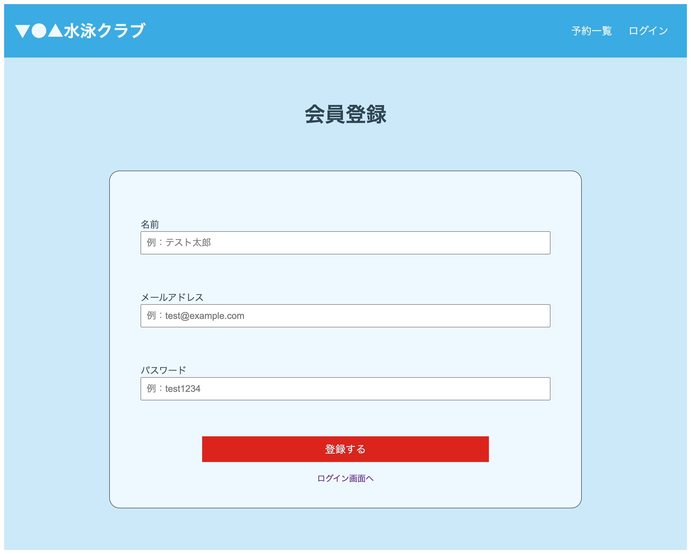
一般ユーザーを新規登録します。  
各項目を入力後、「登録する」をクリックすると、ユーザーを作成し、プロフィール設定画面へ遷移します。  
登録ボタンの下にある「ログイン画面へ」をクリックすると、ログイン画面へ遷移します。

---

#### ログイン画面

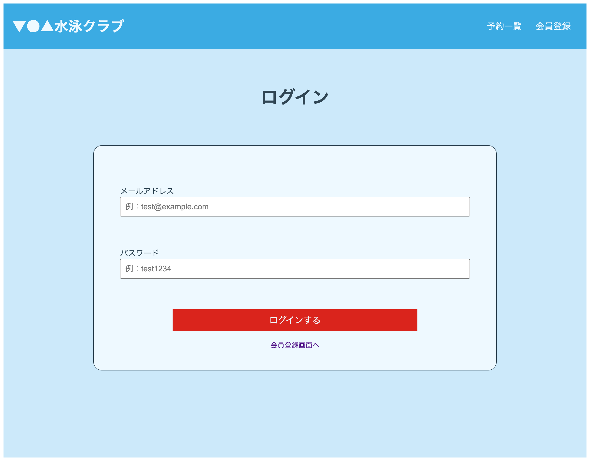
usersテーブルのメールアドレスとパスワードを入力して一般ユーザーとしてログインします。  
ログインに成功すると、予約一覧画面へ遷移します。  
ログインボタンの下にある「会員登録画面へ」をクリックすると、会員登録画面へ遷移します。

---

#### 予約一覧画面

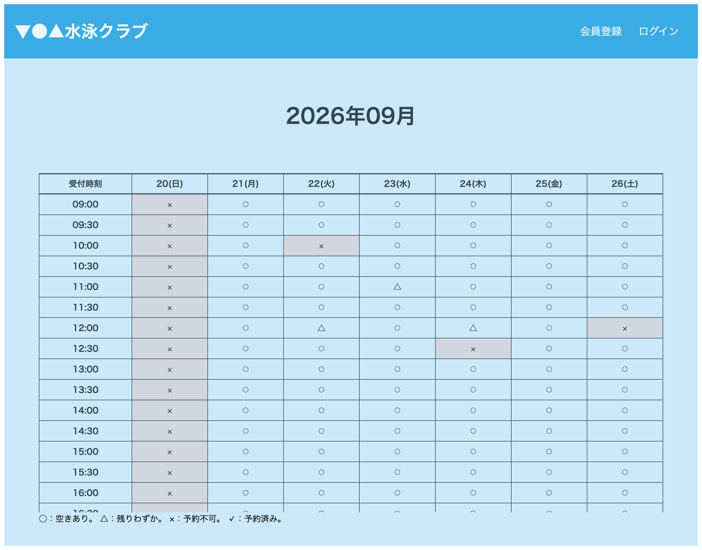
予約状況を表示します。  
タイトルに今年月を表示し、リストのカラムには、当日から一週間分の日付が表示されます。

各記号の内容は下記となります。  
| 記号 | クリック後の動作 | 表示条件
| :-------------: | ------------- | ------------- |
| ○ | ログイン画面へ遷移 | 予約枠に十分な空きがある日時 |
| △ | ログイン画面へ遷移 | 予約枠が残りわずかの日時 |
| × | 変化なし | 満員、または過去の日時 |

「○・△」クリック後、正常にログインが完了すると、クリックした日時で予約確認画面へ遷移します。  
※すでに予約済みのユーザーでログインした場合、予約一覧画面へ遷移し、エラーが表示されます。

---

**ログイン後(認証済)**

#### 予約一覧画面

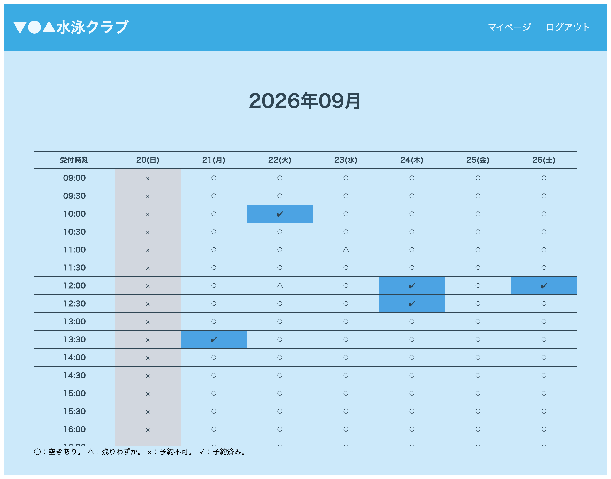
予約状況を表示します。  
一つの予約枠に予約できる人数は、time_slotsテーブルのcapacityデータ(初期値は全て7人)です。  
各記号の内容は下記となります。

| 記号 | クリック後の動作       | 表示条件                               |
| :--: | ---------------------- | -------------------------------------- |
|  ○   | 予約確認画面へ遷移     | 予約枠に十分な空きがある日時           |
|  △   | 予約確認画面へ遷移     | 予約枠が残りわずかの日時               |
|  ×   | 変化なし               | 満員、または過去の日時                 |
|  ✔︎   | 予約取消確認画面へ遷移 | ログインユーザー自身が予約している日時 |

---

#### 予約確認画面

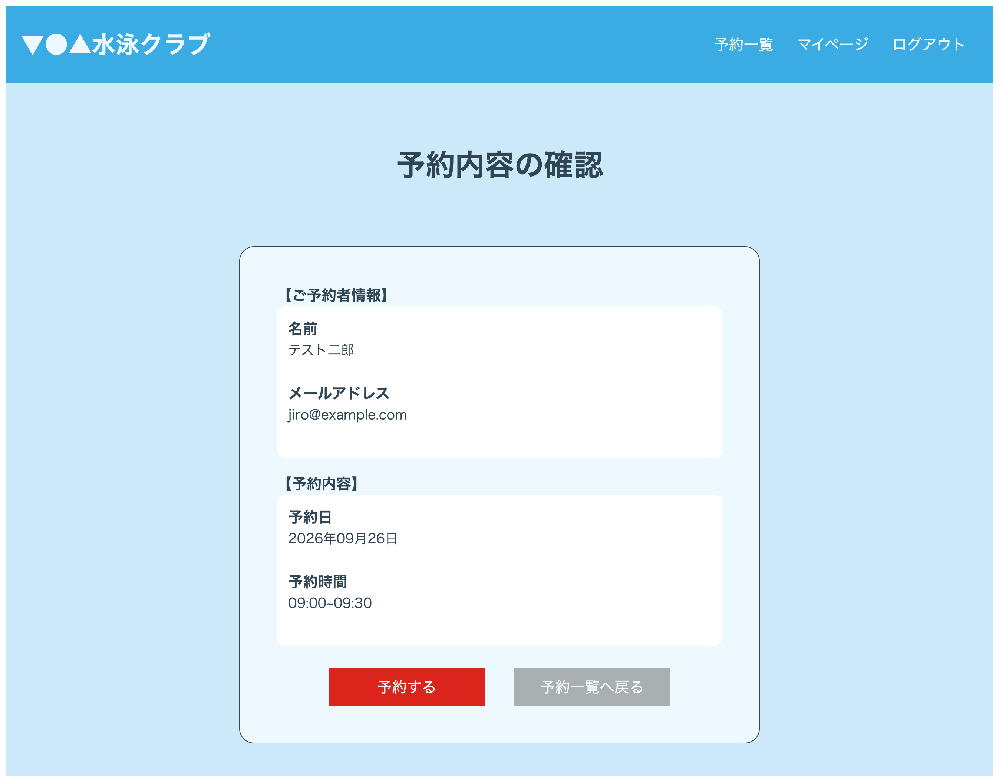
「予約する」をクリックすると、表示内容で予約し、予約一覧画面へ遷移します。  
予約が完了すると、ヘッダーにメッセージが表示されます。  
「予約一覧へ戻る」をクリックすると、予約一覧画面へ遷移します。  
※過去日時・存在しない予約枠・予約満員の場合、予約一覧画面へ遷移し、エラーが表示されます。

---

#### 予約取消確認画面

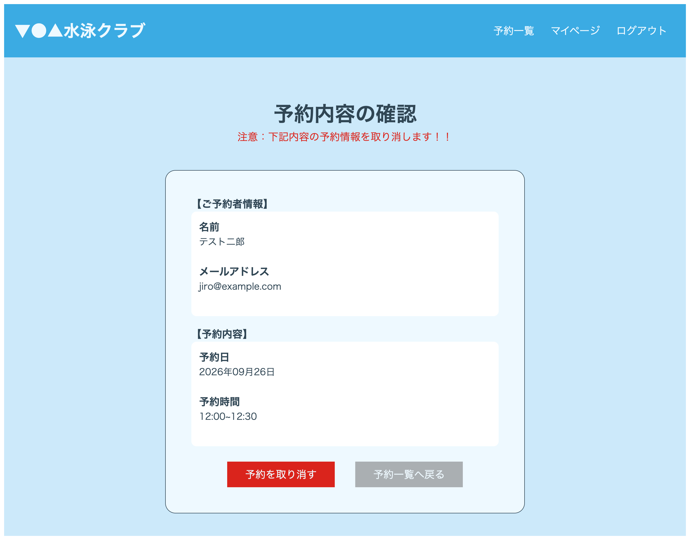
「予約を取り消す」をクリックすると、表示内容で予約を取り消し、予約一覧画面へ遷移します。  
予約を取り消すと、ヘッダーにメッセージが表示されます。  
「予約一覧へ戻る」をクリックすると、予約一覧画面へ遷移します。

---

#### マイページ画面

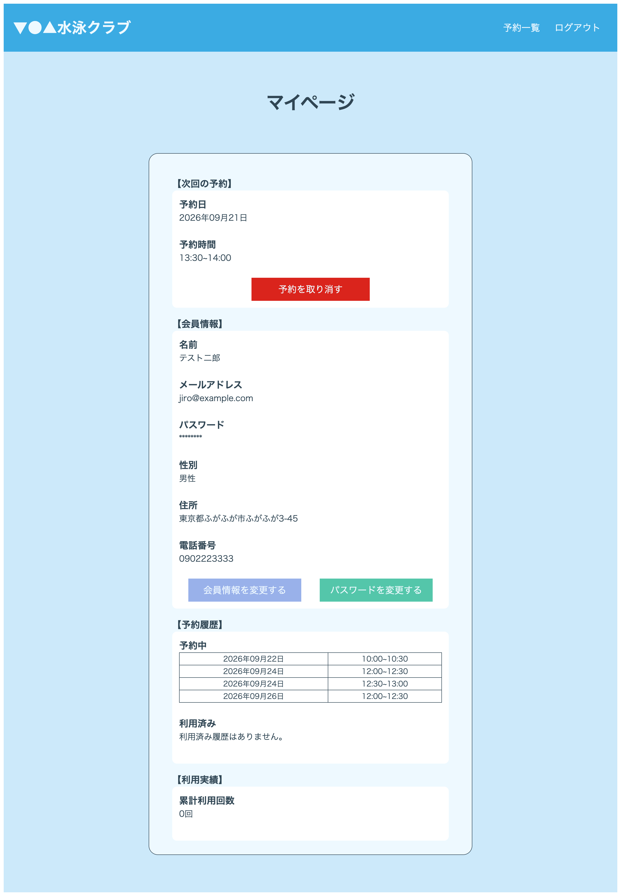
ログインユーザーの情報を表示します。

次回の予約  
現在日時以降の予約から、最も近い予約を表示します。  
「予約を取り消す」をクリックすると、予約取消確認画面へ遷移します。  
次回の予約がない場合は、「次回の予約はありません。」と表示します。

会員情報  
現在登録しているユーザー情報を表示します。

##### 👤 会員情報を変更する

未回答の項目がある場合は「プロフィールの設定」と表示されます。  
クリックすると会員情報の編集モードになります。  
性別・住所・電話番号は未回答でも更新可能です。  
電話番号はハイフンなしの10or11桁で入力してください。  
「変更する」で会員情報を更新します。  
「キャンセル」で会員情報を更新せず、編集モードを解除します。

##### 🔑 パスワードを変更する

パスワード変更用のモーダル画面を表示します。  
現在のパスワード、新しいパスワード、確認用パスワードを入力して変更します。  
「変更する」でパスワードを更新します。  
「キャンセル」でパスワードを更新せず、モーダル画面を閉じます。

予約履歴  
現在日時と比較し、予約中と利用済みに分けて表示します。  
予約中の履歴がない場合は、「予約履歴はありません。」と表示します。  
利用済みの履歴がない場合は、「利用済み履歴はありません。」と表示します。

利用実績  
利用した回数を表示します。

パスワード変更モーダル画面
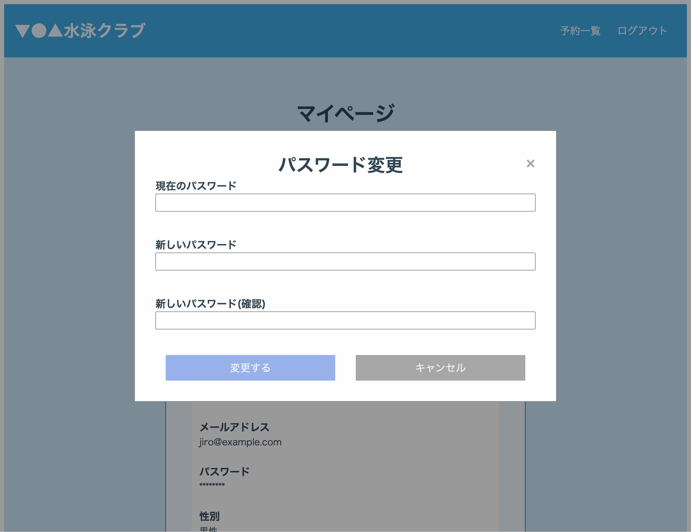

---

#### プロフィール設定画面

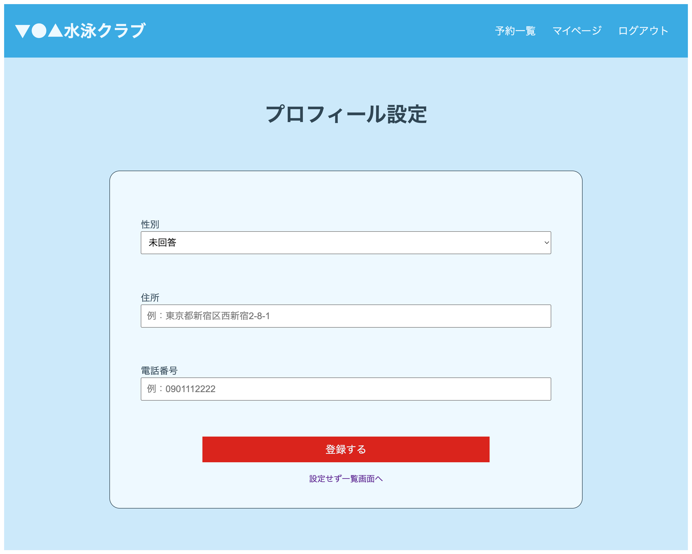
会員登録画面で作成したユーザーの性別・住所・電話番号を設定できます。  
電話番号はハイフンなしの10桁または11桁で入力してください。  
各項目を入力し、「登録する」をクリックすると設定を保存して一覧画面へ遷移します。  
「設定せず一覧画面へ」をクリックすると、プロフィールを設定せずに一覧画面へ遷移できます。

---

### 管理者向け

**ログイン前(未認証)**

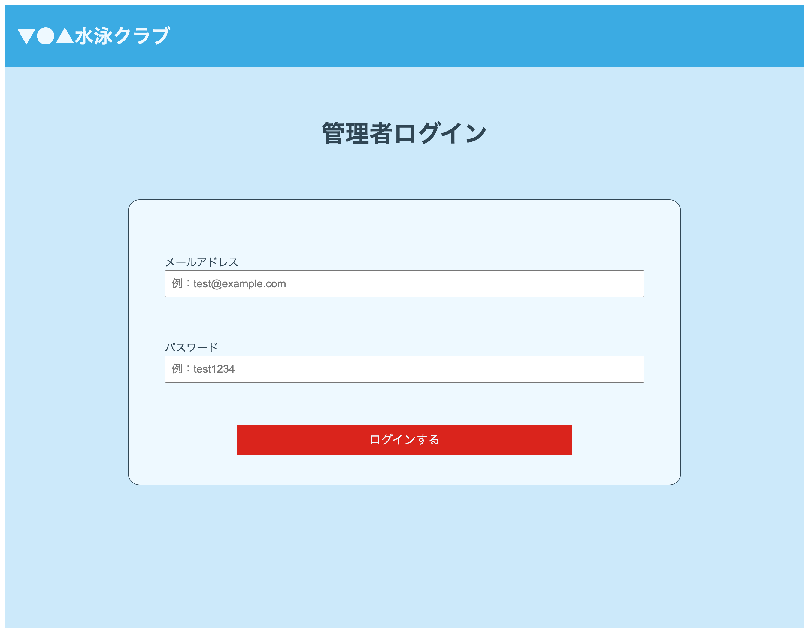
adminsテーブルのメールアドレスとパスワードを入力して管理者としてログインします。  
ログインに成功すると、予約管理画面へ遷移します。  
※予約管理画面は作成中のため、テスト用の画面が開きます。

## 使用技術

### フロントエンド

- Nuxt 4

### バックエンド

- PHP 8.4.2
- Laravel 8.83.29
- tymon/jwt-auth
- MySQL 8.0.26

### 開発環境

- Docker / Docker Compose

## ER図

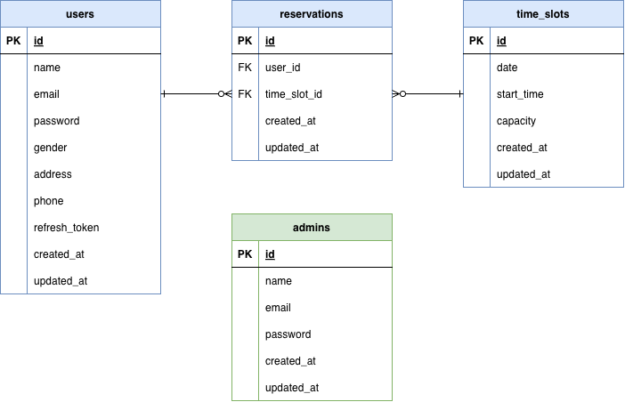

## URL

- 会員登録画面：http://localhost:3000/register
- ログイン画面：http://localhost:3000/login
- 予約一覧画面：http://localhost:3000/list
- 管理者ログイン画面：http://localhost:3000/admin/login
- phpMyAdmin：http://localhost:8080/
